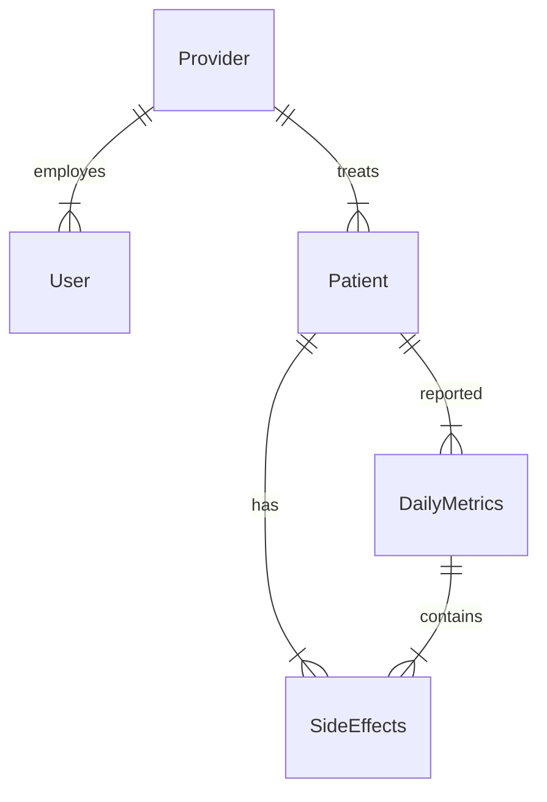

## Levl Health Provider Portal

### Logical Database Schema

#### Tables

##### Provider

| column name  | data type | key | attributes    |
| ------------ | --------- | --- | ------------- |
| id           | Int       | PK  | autoincrement |
| practiceName | String    |     |               |
|              |           |     |               |

##### User

| column name | data type | key | attributes    |
| ----------- | --------- | --- | ------------- |
| id          | Int       | PK  | autoincrement |
| providerId  | Int       | FK  | required      |
| firstName   | String    |     | required      |
| lsatName    | String    |     |               |

##### Patient

| column name | data type | key | attributes              |
| ----------- | --------- | --- | ----------------------- |
| id          | Int       | PK  | autoincrement           |
| providerId  | Int       | FK  | required                |
| active      | Boolean   |     | required, default=true  |
| overdue     | Boolean   |     | required, default=false |
| riskStatus  | Int       |     |                         |
| firstName   | String    |     | required                |
| middleName  | String    |     |                         |
| lastName    | String    |     | required                |
| avatar      | Blob      |     |                         |
|             |           |     |                         |

##### DailyMetrics

| column name  | data type | key | attributes    |
| ------------ | --------- | --- | ------------- |
| id           | Int       | PK  | autoincrement |
| patientId    | Int       | FK  | required      |
| adhd         | Int       |     |               |
| anxiety      | Int       |     |               |
| depression   | Int       |     |               |
| createdAt    | DateTime  |     | required      |
| mood         | String    |     |               |
| dosages      | Int       |     |               |
| dosagesTaken | Int       |     |               |
| checkedIn    | Boolean   |     |               |
| moodLevel    | Int       |     |               |

##### SideEffects

| column name      | data type | key | attributes    |
| ---------------- | --------- | --- | ------------- |
| id               | Int       | PK  | autoincrement |
| patientMetricsId | Int       | FK  | required      |
| patientId        | Int       | FK  | required      |
| title            | String    |     | required      |
